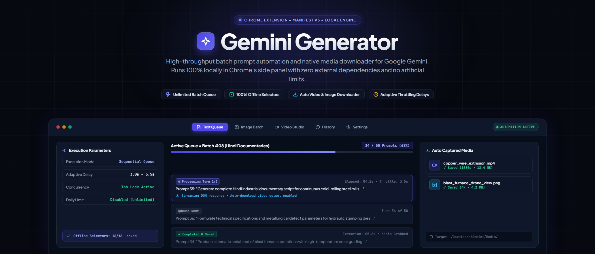

<div align="center">



# Gemini Generator

Batch prompt automation and media downloader Chrome extension for Google Gemini.

[](https://developer.chrome.com/docs/extensions/mv3/intro/)
[](https://github.com/Yeamin-Sheikh/Gemini-Generator/releases/tag/v1.1)
[](https://www.google.com/chrome/)
[](LICENSE)

</div>

Gemini Generator is a Chrome extension for batch prompt automation and automatic media downloading on Google Gemini (gemini.google.com). It runs directly inside Chrome's native side panel, allowing you to queue multi-line prompts, import spreadsheets, configure random delays, and save generated text, image, and video outputs to local storage.

The extension is self-contained. All automation selectors and logic run locally in the browser with no external server dependencies, user accounts, or prompt limits.

---

## Supported automation modes

| Mode | Input | Gemini target | Output |
|---|---|---|---|
| Text to Video | Written prompt list | Veo video models | MP4 video files |
| Frame to Video | Keyframe image + prompt | Image-to-video pipeline | MP4 video files |
| Ingredients to Video | Multi-image components + prompt | Multi-reference generation | MP4 video files |
| Text to Image | Written prompt list | Imagen models | WebP / JPEG image files |
| Image to Image | Reference images + prompt | Image variation pipeline | WebP / JPEG image files |
| Text Processing | Bulk questions or instructions | Gemini chat | Downloaded text logs / responses |
| Ingredients to Text | Image attachments + questions | Multimodal analysis | Downloaded text logs / responses |

---

## Capabilities

- Batch prompt input: Enter prompts manually, upload `.txt` files, or import `.xlsx` and `.csv` spreadsheets.
- Execution controls: Configure prompt concurrency (single or simultaneous batches) and random delay intervals to avoid rate limits.
- Automated media extraction: Detects finished generation items on the page and triggers background downloads automatically.
- Custom file routing: Define download folder names and filename prefixes for organized asset storage.
- Local selector engine: Bundles 16 Google Gemini DOM selectors inside the extension, eliminating dependency on external configuration endpoints.
- English interface: Stripped of secondary language dictionaries to reduce extension bundle size to 1 MB.
- Electric Indigo theme: Formatted for high-DPI displays with complete dark mode support.

---

## Installation

### Option 1: Load from release archive

1. Download `Gemini-Generator-v1.1.zip` from the [Releases page](https://github.com/Yeamin-Sheikh/Gemini-Generator/releases/tag/v1.1).
2. Extract the zip archive to a local folder on your computer.
3. Open Google Chrome and navigate to `chrome://extensions/`.
4. Turn on the Developer mode toggle in the top-right corner.
5. Click the "Load unpacked" button in the top-left menu.
6. Select the extracted folder containing `manifest.json`.

### Option 2: Clone from source

1. Clone the repository locally:
   ```bash
   git clone https://github.com/Yeamin-Sheikh/Gemini-Generator.git
   ```
2. Open Google Chrome and navigate to `chrome://extensions/`.
3. Enable Developer mode.
4. Click "Load unpacked" and select the cloned directory.

---

## How to use

1. Navigate to [gemini.google.com](https://gemini.google.com) and sign in to your Google account.
2. Click the Gemini Generator icon in the Chrome toolbar or open the Chrome side panel.
3. Select your desired generation mode under the Control tab (for example, Text to Image or Text to Video).
4. Set your execution parameters:
   - Concurrent prompts: Number of prompts processed simultaneously.
   - Random delay: Minimum and maximum pause between consecutive submissions in seconds.
5. Add your prompts in the Prompts field, or click "Upload .txt file" / "Upload .xlsx / .csv".
6. Click Start. The extension will navigate Gemini, submit each prompt, wait for completion, and save the generated media files to your configured download folder.

---

## Project structure

```text
Gemini-Generator/
├── manifest.json              Manifest V3 configuration, permissions, and icons
├── service-worker-loader.js   Entry point for background service worker
├── logo.png                   Extension icon asset
├── assets/
│   ├── banner.png             Project header banner graphic
│   ├── catchUploadFile.*.js   DOM file upload injector for Gemini attachments
│   ├── index-*.css            Tailwind CSS styling and Electric Indigo theme tokens
│   ├── index.html-*.js        Compiled Vue side panel application logic and UI
│   ├── index.ts-*.js          Content script and background service worker logic
│   ├── primeicons-*           Icon font assets (woff2, eot, svg, ttf, woff)
│   └── remoteConfig-*.js      Local selector registry for Google Gemini DOM elements
├── src/
│   ├── assets/                Source logos and graphics
│   └── ui/
│       └── side-panel/        Side panel HTML entry point
├── LICENSE                    MIT license terms
├── PROGRESS.md                Session changelog and development history
└── README.md                  Project documentation
```

---

## Extension permissions

| Permission | Purpose |
|---|---|
| `storage` | Saves user preferences, folder paths, and delay settings locally in Chrome. |
| `tabs` and `activeTab` | Detects when `gemini.google.com` is active and interacts with the tab. |
| `sidePanel` | Renders the control interface inside the native Chrome side panel. |
| `downloads` | Saves generated video files, images, and text outputs directly to disk. |
| `debugger` | Simulates keyboard input and file drop interactions on Gemini. |

---

## License

This project is licensed under the MIT License. See [LICENSE](LICENSE) for details.
